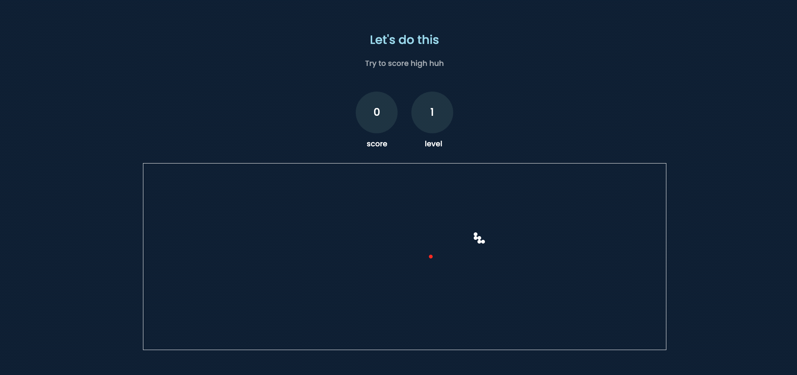

# COMP 531 Assignment 3 JavaScript Game

### Quick Info

Netid: sh122

Title: Snake Game

Site: http://eminent-goldfish.surge.sh

### Description 

This is the assignment 3 of COMP 531, Web Development, JavaScript Game. The author created a new-defined, cursor-based java game. 

### Get Started

[Game Website](http://eminent-goldfish.surge.sh)

### Game Rules

#1 Use your cursor to control the direction. The direction relative to the head of snake is your direction.

#2 If your cursor is in the canvas, your game is started. If your mouse is off the canvas, you can't do any operation.

#3 Can't move toward the upsite direction. Your snake is initially set as upward.

#4 If you eat apple, you win a point and also make yourself one unit longer.

#5 If you hit the wall, or your self, your game is over.

#6 <Special> Level will increase when you get more points. Your speed may be accerated as your level is higher.

### Author

[Shu-Chuan Hsu](https://github.com/leo880714)

